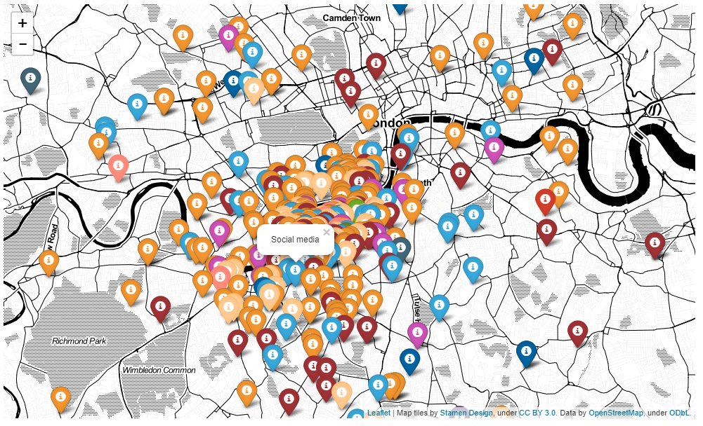

# mapping_Salesforce_Leads_by_Campaign
The Jupyter notebook in this repo gives an example Python script showing how to create a geographical map of Salesforce Leads associated to a particular Campaign, similar to this:

The map is created with the Python package <a href="https://github.com/python-visualization/folium">*folium*</a>; the Salesforce data is scraped using <a href="https://github.com/simple-salesforce/simple-salesforce">*simple_salesforce*</a>.
